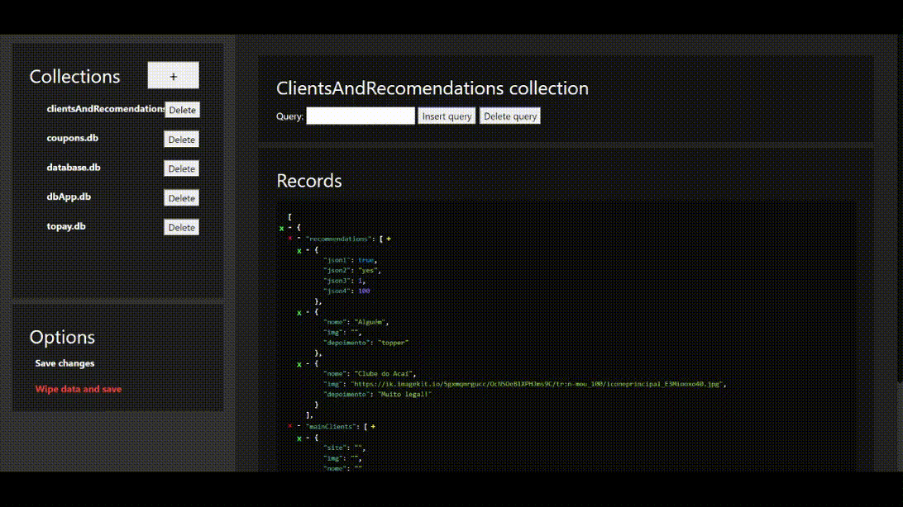

# NeDB UI
Many people are pretty familiar to [NeDB](https://github.com/louischatriot/nedb) due to [The Coding Train](https://www.youtube.com/c/TheCodingTrain) YouTube video tutorials (*and I'm one of them!*), but unfortunately it doesn't really have a GUI so if you are like me and store the whole world in those, it can get quite messy.
### *So... What does it do?!*
The name is self-explanatory. It's a user interface for devs who use [NeDB](https://github.com/louischatriot/nedb)
### *And what can I do with it?*
With this tool you can basically create, edit and delete collections and records with better UX and a decent UI.
## Screenshots

  
GIFs

  The view of a Database:
  
  
  Creating and deleting records:
  
  

## Getting Started
### Setting up the WebView
Well, the WebView is pretty much forked from [Pynosh](https://github.com/mococa/pynosh), another repo of mine. So all the requirements are there.
But for the sake of your lazyness... :
##### First step:
Run:  

    pip install pywebview
#### Done!
Now you only have to execute the `main.py` file after setting the `manifest.json` file as your needs.
(Run `python ./main.py` or `python3 ./main.py` in the NeDB UI root folder )

#### Alternatively:
If you don't mind using your browser, you can simply set things up as shown in Setting Up, then running "node index.js" in the root folder.

## Setting Up
NeDB-UI uses JSON for its configuration: `manifest.json`, so you don't have to worry about it.
The location in it stands for your Node project path (The one using NeDB)
*Windows users don't miss your inverted slashes `\`*
And in the port you can just set a free port you're not using.

## Credits
[Me](https://www.linkedin.com/in/luiz-felipe-s-7539b7127/), Luiz Felipe Sousa Moureau Linhares
##### Libraries used:
- [Pynosh](https://github.com/mococa/pynosh)
- [PyWebView](https://github.com/r0x0r/pywebview)  
- [JQ](https://github.com/stedolan/jq) (Optional for shortcut maniacs)
- [JSONTreeView](https://github.com/lmenezes/json-tree)

## License
  [Here](https://github.com/mococa/pynosh/blob/main/LICENSE)
